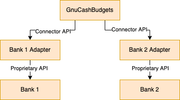

# Connector API

We are going to integrate with many banks. Some of them have their own API, some of them don't.

For those who don't we will turn on sending mails to our inbox and then parse all the mails (with all transactions)



## Adapters

Adapters are going to work via REST API. Every bank adapter will have standalone service

## Specification

This document outlines the interface and functionalities of the Bank Connector API, 
tailored specifically for retrieving expense data within our custom banking application. 
It enables seamless integration with the bank's existing API for fetching expense-related information.

### Authentication and Authorization:

Authentication mechanism: Developers will need to obtain an API key or token from the bank to authenticate requests.
Authorization: Access permissions should be granted to the API key/token for reading expense data.

### Data Format:

The bank's API returns all data in `JSON` format,
containing details such as `transaction ID`, `amount`, `currency`, `category`, `description`, and `timestamp`.

### Error Handling:

Developers should handle potential errors gracefully by checking for error responses and displaying relevant messages to users.
Possible error codes include `4xx` client errors (e.g., invalid parameters) and `5xx` server errors.

### Endpoints and their Descriptions:

#### /expenses/history

* Endpoint: `/expenses/history`
* Method: `GET`
* Description: This endpoint retrieves the history of expense transactions for the user's account within a specified time range.

##### Request Parameters:

Optional parameters:

* `start_date`: Specifies the start date of the time range for which expense transactions should be retrieved. 
If provided, only transactions that occurred on or after the specified start date will be included in the response. 
  * Data Type: `String (ISO 8601 format)`
  * Example: `"start_date": "2024-01-01"`
  * Description: This parameter allows filtering expense transactions based on their transaction dates. 
  If omitted, transactions from any date will be included in the response. 
* `end_date`: Specifies the end date of the time range for which expense transactions should be retrieved. 
If provided, only transactions that occurred on or before the specified end date will be included in the response. 
  * Data Type: `String (ISO 8601 format)`
  * Example: `"end_date": "2024-12-31"`
  * Description: This parameter allows further refining the time range for retrieving expense transactions. 
  If omitted, transactions up to the current date will be included in the response.
* `currency`: Specifies the currency in which the expense transactions should be retrieved. 
If provided, only transactions in the specified currency will be included in the response. 
  * Data Type: `String`
  * Example: `"currency": "USD"`
  * Description: This parameter allows filtering expense transactions based on the currency used for the transactions. 
  If omitted, expense transactions in all currencies will be included in the response.

##### API Responses:

###### Successful response (Status code 200):

* The response contains an array of expense objects, each representing a single transaction. 
* Each expense object includes fields like `transaction ID`, `amount`, `currency` and `timestamp`.

| Name             | Nullable | Data Type                | Description                                                                                                |
|------------------|----------|--------------------------|------------------------------------------------------------------------------------------------------------|
| `transaction_id` | No       | String                   | Unique identifier of the transaction, used to identify a specific expense                                  |
| `amount`         | No       | Decimal                  | The amount of the transaction spent                                                                        |
| `currency`       | No       | String                   | The currency in which the transaction was made (e.g., USD, EUR)                                            |
| `category`       | Yes      | String                   | The category to which the expense belongs (e.g., groceries, housing, transportation)                       |
| `description`    | Yes      | String                   | A description of the transaction, providing additional information about what the transaction was made for |
| `timestamp`      | No       | String (ISO 8601 format) | The timestamp of the transaction, indicating the date and time when the transaction occurred               |
| `merchant`       | Yes      | String                   | The name or identifier of the merchant where the transaction was made                                      |
| `payment_method` | Yes      | String                   | The payment method used for the transaction (e.g., debit card, credit card, bank transfer)                 |
| `location`       | Yes      | String                   | The location where the transaction was made (e.g., merchant's address or GPS coordinates)                  |

```json
{
  "expenses": [
    {
      "transaction_id": "EXP123456789",
      "amount": 50.00,
      "currency": "USD",
      "category": "Groceries",
      "description": "Grocery shopping for the week",
      "timestamp": "2024-04-02T12:00:00Z",
      "merchant": "ABC Supermarket",
      "payment_method": "Debit Card",
      "location": "123 Main St, City, Country"
    },
    {
      "transaction_id": "EXP987654321",
      "amount": 20.00,
      "currency": "USD",
      "category": null,
      "description": null,
      "timestamp": "2024-03-30T13:30:00Z",
      "merchant": "XYZ Restaurant",
      "payment_method": "Credit Card",
      "location": "456 Elm St, City, Country"
    }
  ]
}

```

##### Error responses (Status code 4xx and 5xx):

* Error messages and corresponding status codes will be returned in case of invalid requests or server errors.

```json
{
  "error": {
    "code": 400,
    "message": "Invalid date format provided"
  }
}

```