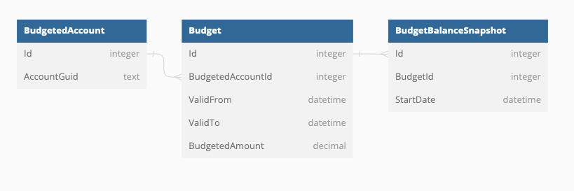

## GNU Cash objects

We're really only interested in expense accounts and their respective transactions at the moment.

## [Own schema](https://dbdiagram.io/d/64a4775402bd1c4a5e7f9bc6)

```
Table BudgetedAccount {
  Id integer
  AccountGuid text
}

Table Budget {
  Id integer
  BudgetedAccountId integer
  ValidFrom datetime
  ValidTo datetime
  BudgetedAmount decimal
}

Table BudgetBalanceSnapshot {
  Id integer
  BudgetId integer
  StartDate datetime
}

Ref: Budget.BudgetedAccountId > BudgetedAccount.Id
Ref: BudgetBalanceSnapshot.Id > Budget.Id
```

