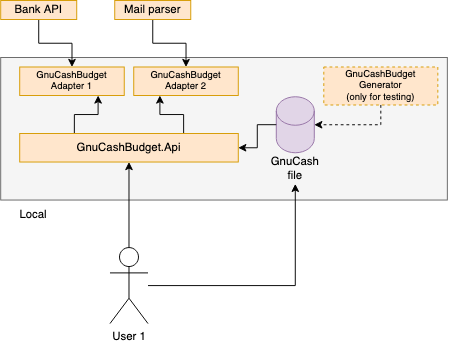
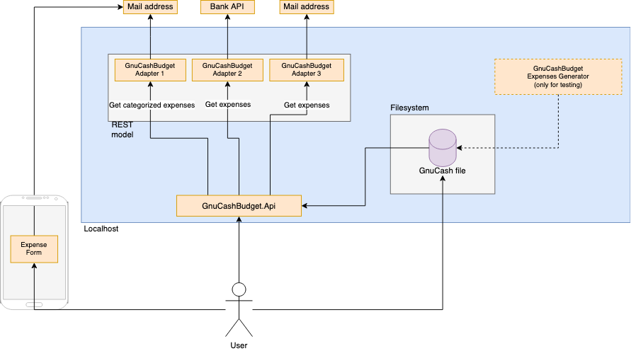

<!-- TOC -->
* [Design](#design)
  * [Cloud vs Localhost](#cloud-vs-localhost)
    * [1. Running on Cloud](#1-running-on-cloud)
      * [This approach would mean](#this-approach-would-mean)
      * [Benefits](#benefits)
      * [Cons](#cons)
    * [2. Running on Localhost](#2-running-on-localhost)
      * [This approach would mean](#this-approach-would-mean-1)
      * [Benefits](#benefits-1)
      * [Cons](#cons-1)
    * [Summary](#summary)
  * [REST vs push/pull model](#rest-vs-pushpull-model)
    * [1. REST api](#1-rest-api)
      * [This approach would mean](#this-approach-would-mean-2)
      * [Benefits](#benefits-2)
      * [Cons](#cons-2)
    * [2. Push/Pull model](#2-pushpull-model)
      * [This approach would mean](#this-approach-would-mean-3)
      * [Benefits](#benefits-3)
      * [Cons](#cons-3)
    * [Summary](#summary-1)
  * [Summary of design](#summary-of-design)
* [Connector API](#connector-api)
  * [Adapters](#adapters)
  * [Specification](#specification)
    * [Authentication and Authorization:](#authentication-and-authorization)
    * [Messages and their Descriptions:](#messages-and-their-descriptions)
      * [Expense message](#expense-message)
        * [Message content](#message-content)
    * [Inputs](#inputs)
    * [Outputs](#outputs)
<!-- TOC -->

# Design

First we need to look at the system design before we can talk about adapters and how to fetch expenses data.

GnuCashBudget Generator exists only for testing purposes. It generates expenses at random and for the purposes of design
could be ignored

Summary of design [here](#summary-of-design)

## Cloud vs Localhost

We have two sensible ways how to look at our system - it will run on [Cloud](#1-running-on-cloud) or [Locally](#2-running-on-localhost)

### 1. Running on Cloud


#### This approach would mean

* Having User Management (log in, etc.)
* Connecting Google Drive in which the GNUCash.sqlite file is saved
  * This would further mean have some checks in place to know if the file was edited (user can download a file, do some changes to Assets and upload it back)
  * Implementing Google Auth
* When an adapter would need permissions to read mail (bank doesn't have an API &rarr; we parse it from the mail) we need to ask user for that and store it somewhere

#### Benefits
* Flexibility of using the app from everywhere
  * Even on phone (you buy something &rarr; expense is read and put in queue in app &rarr; you can immediately categorize it)

#### Cons
* Devs need to implement more stuff and it is more complicated
* User's data (and all expenses, assets) are uploaded to "somewhere"
* It would cost more money (deployments, managed databases)

### 2. Running on Localhost



#### This approach would mean

* No User Management
* There is no need to connect Google Drive
  * You can install a plugin to your desktop and read the file from filesystem
* Mail user/pass is saved in appsettings/local secrets and read directly

#### Benefits
* Easier for the devs to implement
* User has all data locally
* Cheaper

#### Cons
* Initial setup
  * User needs to run Docker, setup variables and have file in filesystem
* No access from mobile devices (when you buy something you need to go to your desktop to categorize the expense)

### Summary

After careful consideration I am recommending to target localhost for now because of the overall simplicity for developers.
In cloud approach we would need to set up user management, authentication and authorization and pay for cloud infrastructure.
Also, some users (this is an open source project) wouldn't like that their entire GNUcash file is uploaded somewhere
(they have their assets and whole financials in a file). Only thing we cannot do when we use localhost approach is we cannot
access the app from mobiles. This will be painful if let's say user is in shop, pays for something and wants to categorize it right then and there.
In localhost approach user has his file on disk whole time (with Google Drive plugin it automatically synchronizes to users cloud)
and after initial set up its easy for him to use the app

## REST vs push/pull model

We also need to look at a way how will adapters communicate with main app

We have two sensible ways how to do it - via [REST](#1-rest-api) or [PUSH/PULL model](#2-pushpull-model)

### 1. REST api


#### This approach would mean

* More development on the main app part
  * All transactions are acquired from adapter service &rarr; main app adds them to some internal "queue" (database table probably) &rarr; show them to the user
  * It needs to write to the database which expenses are categorized
* Implementing caching (to database) in adapter services
  * To not parse all mails with every call
  * To not call Bank API to get all expenses every time

#### Benefits

* Simpler initial setup of adapter services
  * Read all the data &rarr; cache them &rarr; send them to the caller
* Less complexity without push/pull provider

#### Cons

* Not so simple development of the main app
  * Getting all data from adapter services and needing to do the rest of the work with it
  * Remembering which expenses are categorized already
    * Having some internal "queue" (database table probably) of non-categorized expenses (to show to the user)
    * With every call application would need to compare data in non-categorized table and incoming data
* Bigger resource utilization
  * Data are send multiple times from adapter to main app
* Using database for caching in adapter services
  * To not call Bank API to get all expenses every time but only new ones
  * To not parse all mails but only new ones

### 2. Push/Pull model


#### This approach would mean

* Having to setup messaging provider
  * Adding it to the Dockerfile
  * Queue needs to be durable and persistent
    * When we quit the whole application (docker) we need to be **sure** the messages added to the queue doesn't disappear
* Having Queue already in place for later usage (showing the user the un-categorized expenses)
* Implementing simple database to remember last datetime of expense data sent to queue
  * Only expenses which weren't put into the queue can be put there

#### Benefits

* Simple development on the main app part
  * When adapter does its work the main app only reads a message from queue and shows it to the user
  * If user does not categorize it the message will remain in the queue until he does (via manual acknowledgements)
* Using only simple database table in adapter services to remember datetime of last expense put into the queue
* Built-in Eventual consistency - if something happens with adapters user can still categorize those message which were delivered previously
 
#### Cons

* Push/Pull provider needs to support DurableQueues and Persistent messages (along with manual acknowledgements)
  * Probably save data to the file-storage &rarr; setting docker correctly to allow it

### Summary

After careful consideration I am recommending to use Push/Pull model because of the overall simplicity for developers.
Adapter services will be developed with same level of difficulty for REST or push/pull model (both approaches need to have database).
Main application will be easier to develop with push/pull model because most of the work will do model provider.
If we use a model provider with manual acknowledgements we can read all messages, show them to the user and acknowledge only
those which user categorizes. Those who are not categorized will remain in queue for the user to process.
Last but not least working with messaging can cause some trouble but in this hobby project I would like to try it out

## Summary of design

Application will be used only on **localhost** ([Explanation here](#summary)) and be using **Push/Pull model** ([Explanation for that here](#summary-1))



# Connector API

We are going to integrate with many banks. Some of them have their own API, some of them don't.

For those who don't we will turn on sending mails to our inbox and then parse all the mails (with all transactions)


## Adapters

* Adapters are going to work via Push/Pull model
* Every bank adapter will have standalone service
* Every adapter would need to regularly check if there is a new data in Bank API or new mails to be parsed


## Specification

This document outlines the interface and functionalities of the Bank Connector API, 
tailored specifically for retrieving expense data within our custom banking application. 
It enables seamless integration with the bank's existing API for fetching expense-related information.

### Authentication and Authorization:

We won't implement authentication and authorization because we plan to run the services only locally via Docker

### Messages and their Descriptions:

#### Expense message

* Name: `ExpenseMessage`
* Description: This message contains the data of expense transaction for the user's account

##### Message content

* Each expense message object includes fields like `amount`, `currency`, `timestamp` and `adapter_name`.
* Other fields are nullable

| Name             | Nullable | Data Type                | Description                                                                                                |
|------------------|----------|--------------------------|------------------------------------------------------------------------------------------------------------|
| `amount`         | No       | Decimal                  | The amount of the transaction spent                                                                        |
| `currency`       | No       | String                   | The currency in which the transaction was made (e.g., USD, EUR)                                            |
| `category`       | Yes      | String                   | The category to which the expense belongs (e.g., groceries, housing, transportation)                       |
| `description`    | Yes      | String                   | A description of the transaction, providing additional information about what the transaction was made for |
| `timestamp`      | No       | String (ISO 8601 format) | The timestamp of the transaction, indicating the date and time when the transaction occurred               |
| `merchant`       | Yes      | String                   | The name or identifier of the merchant where the transaction was made                                      |
| `payment_method` | Yes      | String                   | The payment method used for the transaction (e.g., debit card, credit card, bank transfer)                 |
| `location`       | Yes      | String                   | The location where the transaction was made (e.g., merchant's address or GPS coordinates)                  |
| `adapter_name`   | No       | String                   | The name of the adapter so when categorizing we know from which source this expense is                     |

```json
{
  "ExpenseMessage1": {
      "amount": 50.00,
      "currency": "USD",
      "category": "Groceries",
      "description": "Grocery shopping for the week",
      "timestamp": "2024-04-02T12:00:00Z",
      "merchant": "ABC Supermarket",
      "payment_method": "Debit Card",
      "location": "123 Main St, City, Country",
      "adapter_name": "Bank of America adapter"
    },
  "ExpenseMessage2": {
      "amount": 20.00,
      "currency": "USD",
      "category": null,
      "description": null,
      "timestamp": "2024-03-30T13:30:00Z",
      "merchant": "XYZ Restaurant",
      "payment_method": "Credit Card",
      "location": "456 Elm St, City, Country",
      "adapter_name": "Bank of America adapter"
    }
}

```

### Inputs

Inputs for each adapter are data got from the bank (either via Bank API or mail parsing/etc.)

To not send the same message twice adapters needs to implement some way how to remember which messages were sent.
Our recommendation is to have simple database table in which you will write last `DateTime` of the expense sent to the queue.

This way if the expense data are parsed and the date and time is AFTER your saved datetime you know it is a new expense,
and you add it to the queue (and of course update the database value)

For Bank API you can save the value and send REST request to your Bank API to only get expenses newer than <datetime saved>

For Mail parser you can parse mails from the TOP and when you find mail older than <datetime saved> you stop parsing. Or you
could just delete older mails and have only new ones in your inbox (empty inbox means every expense was added to the queue)

### Outputs

Outputs of each adapter are messages sent into the `Queue`.

Queue has to be `Durable` and messages needs to be `Persistent`.
Push/Pull model provider needs to be set to save data on disk. We will be using Docker to run the whole app which means
when user quits Docker we **need to keep all messages**

The main application will use `Manual Acknowledgement` for the messages in queue and tag message as delivered only after
user categorizes the expense. If he does not the message stays in queue and user will see it again when he goes to the 
expenses-to-be-categorized page

